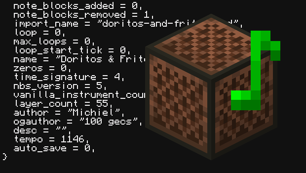

# NBS Tunes for CC

Easily parse any version of the Note Block Studio (.nbs) music format in ComputerCraft!

[View on PineStore](https://pinestore.cc/projects/18/nbs-tunes)

Features:
- can parse each version (0-5) of the .nbs format!
- parse just the format for raw data, or load the file as music to be played in your project/game easily
- custom instruments (not just noteblock sounds, but also any sound in Minecraft)
- music looping (from any starting point)

Try it out by running play.lua to hear Doritos and Fritos!

You can include the nbsTunes.lua file in any of your projects without asking for permission :)

## Example

```lua
local nbsTunes = require("nbsTunes")

-- To use custom instruments, you need to map the filename in the .nbs file to a Minecraft sound id
-- The example with custom instruments has an exploding creeper sound
-- nbsTunes.setCustomInstrument("explode1.ogg", "entity.generic.explode")
-- local music = nbsTunes.load("custom_instruments.nbs")

-- Load Doritos and Fritos, 100 gecs (converted to .nbs by Michiel)
local music = nbsTunes.load("100_gecs_Doritos_Fritos.nbs")

-- Show the parsed metadata
print(textutils.serialise(music.data.meta))

-- Play the music
music:play()
```

You can play, pause, reset or stop the music as well

```lua
music:play() -- starts/continues playing
music:pause() -- pauses playing
music:reset() -- reset music to play from start
music:stop() -- pause + reset
```

The example music file is Doritos and Fritos by 100 gecs (and converted to MIDI/NBS by Michiel)
